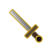

<table>
<tr>
<td width="90" align="right" valign="middle">

</td>
<td align="center" valign="middle">

</td>
<td width="90" align="left" valign="middle">

</td>
</tr>
</table>

> *"Descanse na fogueira. O deploy aguenta mais um ciclo."*

 

<table>
<tr>
<td width="58%" valign="top">

&nbsp; **Sobre mim**

 

Desenvolvedor **Full Stack** com **1+ ano de entregas em produção**. Construo e opero sistemas completos — APIs, front-end React/Next.js, PWAs, bots Discord, servidores MCP e ambientes em **Docker Swarm** com Traefik e TLS.

**O que entrego no dia a dia**

- Automação de fluxos e integrações com **n8n**, Node.js e IA
- E-commerce em **Magento 2** e landing pages para clientes
- Rede social em produção com **GraphQL**, React, PWA e orquestração em Swarm
- Homelab com **43+ serviços** — Traefik, MCP, monitoramento e bots
- Portfólio profissional em **Next.js** com i18n e geração de PDF para recrutadores

📍 Praia Grande, SP · **Remoto** · Inglês **B2** · PJ e CLT

📄 [Currículo PT](https://curriculo.botingnonlab.com.br/api/resume-pdf) · [Currículo EN](https://curriculo.botingnonlab.com.br/api/resume-pdf?lang=en) · [Portfólio](https://curriculo.botingnonlab.com.br)

</td>
<td width="42%" valign="top" align="center">

  

**Stack**

 

</td>
</tr>
</table>

 

&nbsp; **Experiência**

 
 

<table>
<tr>
<td width="28%" valign="top"><strong>Tracking HighEnd</strong></td>
<td width="72%" valign="top">
Automação de dados, integrações e pipelines com IA 
  
</td>
</tr>
<tr><td colspan="2"> </td></tr>
<tr>
<td width="28%" valign="top"><strong>Quiosque Sex Shop</strong></td>
<td width="72%" valign="top">
Desenvolvimento e manutenção de loja Magento 2 
 
</td>
</tr>
<tr><td colspan="2"> </td></tr>
<tr>
<td width="28%" valign="top"><strong>Workana</strong></td>
<td width="72%" valign="top">
Freelancer — landing pages, automações e entregas sob demanda 
  
</td>
</tr>
<tr><td colspan="2"> </td></tr>
<tr>
<td width="28%" valign="top"><strong>Botinho Lab</strong></td>
<td width="72%" valign="top">
Infraestrutura própria, homelab e projetos pessoais em produção 
   
</td>
</tr>
</table>

### 🤝 Vamos conversar?

**Disponível para remoto · PJ e CLT**

[Portfólio](https://curriculo.botingnonlab.com.br) · [LinkedIn](https://www.linkedin.com/in/guilherme-botingnon/) · [WhatsApp](https://wa.me/5513997571641) · [E-mail](mailto:guilherme.botingnon@gmail.com)

 

 

**Praise the Sun** ☀️

